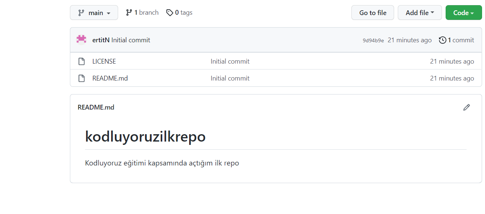

#         Kodluyoruz Ilk Repo
  Bu repo [Kodluyoruz](https://www.kodluyoruz.org/) Front-end eğitiminde oluşturduğumuz ilk repo. İçerisinde bir adet

README dosyası, bir adet de index.html barındırıyor.




#### Installation
---
Öncelikle projeyi clonelayın.(Buraya sizin reponuzdan aldığınız link gelecek)

```
git clone https://github.com/ertitN/kodluyoruzilkrepo.git
```

#### Usage
Projeyi cloneladıktan sonra Visual Studio Code programı içinde açınız

Linux için:

```
cd Kodluyoruzilkrepo
code .
```

#### Contributing

Pull requestler kabul edilir. Büyük değişiklikler için, lütfen önce neyi değiştirmek istediğinizi tartışmak için bir konu açınız.

#### License

[MIT]()


